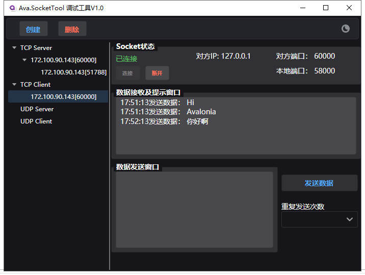
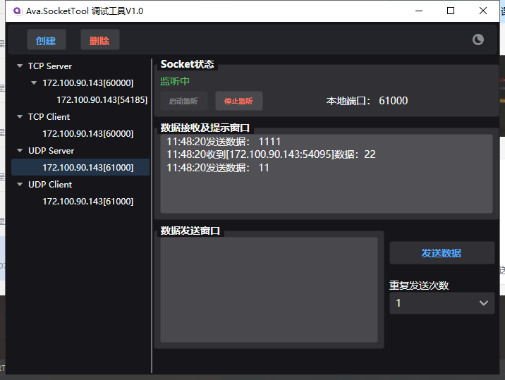
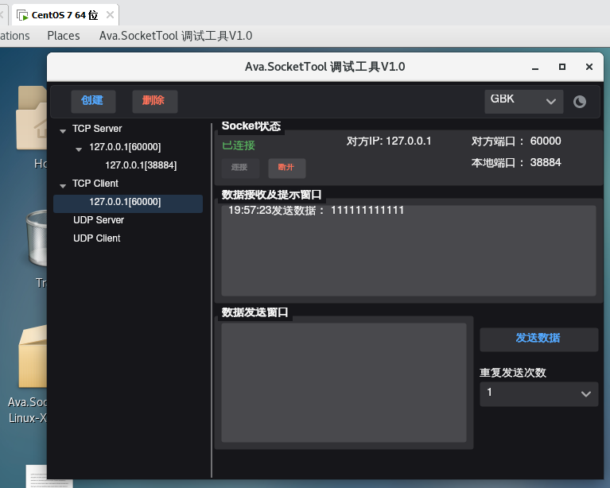

# Ava.SocketTool

## 介绍
Ava.SocketTool 是一个模仿 SocketTool软件 的Socket调试工具

## 感谢

[SocketTool](https://gitee.com/chengjianxi/SocketTool)

[Avalonia](https://github.com/AvaloniaUI/Avalonia)

[Semi.Avalonia](https://github.com/irihitech/Semi.Avalonia)

[SuperSocket](https://github.com/kerryjiang/SuperSocket)

